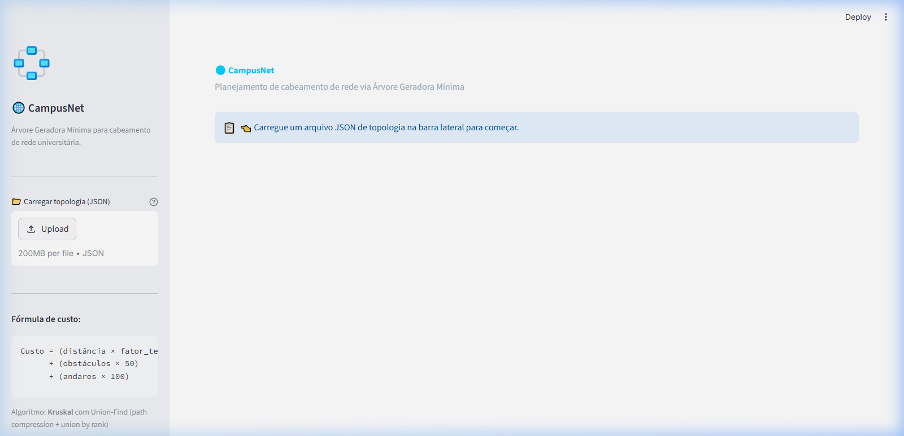
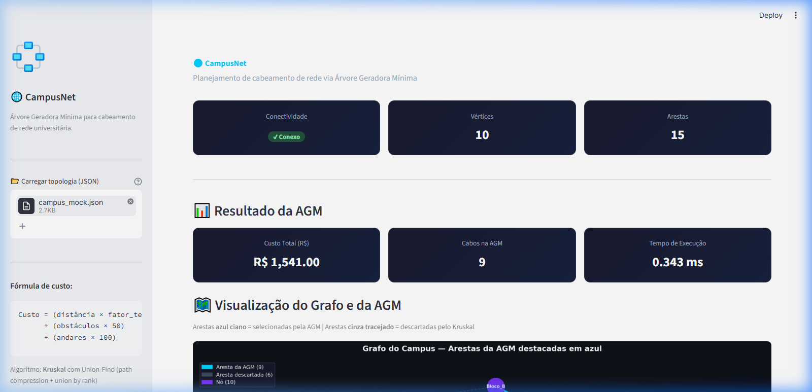

# E3 — MVP: Núcleo Funcional com Primeiras Telas

> **Disciplina:** Teoria dos Grafos  
> **Prazo:** 10 de maio de 2026  
> **Peso:** 25% da nota final  

---

## Identificação do Grupo

| Campo | Preenchimento |
|-------|---------------|
| Nome do projeto | CampusNet - Otimizador de Infraestrutura de Rede |
| Repositório GitHub | https://github.com/Rlokin222/campusnet-grafos |
| Integrante 1 | Igor Nonaka — RA 37420518 |
| Integrante 2 | Marcus Gabriel — RA 39262901 |
| Integrante 3 | Ronald Lopes — RA 38899817 |

---

## 1. Como Executar o MVP

> Instrua como rodar o projeto do zero. Alguém que nunca viu o código deve conseguir executar seguindo estas instruções.

**Pré-requisitos:**
```bash
Python 3.10+
```

**Instalação:**
```bash
# Clone o repositório
git clone [https://github.com/Rlokin222/campusnet-grafos.git](https://github.com/Rlokin222/campusnet-grafos.git)
cd campusnet-grafos

# Instale as dependências (Streamlit e Pytest)
pip install -r requirements.txt
```

**Execução:**
```bash
# Comando para rodar a interface web do MVP
streamlit run src/app.py
```

**Saída esperada:**
```text
O navegador abrirá automaticamente no endereço http://localhost:8501 exibindo a interface do CampusNet. O usuário poderá fazer o upload do arquivo JSON e visualizar a Árvore Geradora Mínima calculada.
```

---

## 2. Algoritmo Implementado

| Campo | Resposta |
|-------|----------|
| Nome do algoritmo | Kruskal (com estrutura Union-Find) |
| Arquivo de implementação | src/algorithms/kruskal.py |
| Complexidade de tempo | $O(E \log E)$ |
| Complexidade de espaço | $O(V)$ |

**Trecho do código com comentário de Big-O:**
```python
# src/algorithms/kruskal.py

# Passo 1 — Ordenação: O(E log E)
sorted_edges: list[Edge] = sorted(graph.edges)   # Edge ordena por peso (dataclass order=True)

# Passo 2 — Inicialização do Union-Find: O(V)
uf = UnionFind(graph.vertices)

mst_edges: list[Edge] = []
total_cost: float = 0.0
target_size = graph.num_vertices - 1  # AGM tem exatamente V-1 arestas

# Passo 3 — Iteração: O(E · α(V))  ≈  O(E)  (α = inversa de Ackermann)
for edge in sorted_edges:
    if uf.union(edge.origem, edge.destino):   # O(α(V)) amortizado
        mst_edges.append(edge)
        total_cost += edge.peso
        if len(mst_edges) == target_size:     # Early-exit: AGM completa
            break

# Total: O(E log E)  dominado pela etapa de ordenação
```

---

## 3. Estrutura do Repositório

> Confirme que a estrutura implementada está de acordo com o E2.

```text
campusnet-grafos/
├── src/
│   ├── core/
│   ├── algorithms/
│   ├── io/
│   └── app.py
├── tests/
├── data/
└── requirements.txt
```

**Desvios em relação ao E2:** 
Em vez de `main.py` genérico, utilizamos `app.py` na raiz do `src/` por ser o padrão de inicialização de interfaces web com a biblioteca Streamlit.

---

## 4. Telas do MVP

> Insira screenshots ou gravações da interface funcionando.

### Tela de Entrada

*Descrição: Tela inicial onde o usuário seleciona o dataset do campus (arquivo JSON) para ser processado. A barra lateral exibe o file_uploader do Streamlit e a fórmula de custo utilizada.*

### Tela de Resultado



*Descrição: Tela exibindo o grafo completo do campus com as arestas da AGM destacadas em azul ciano, a tabela de cabos selecionados, o custo total financeiro e as métricas de desempenho do algoritmo.*

---

## 5. Testes Unitários

| Algoritmo | Caso de teste | Status | Comando para executar |
|-----------|--------------|--------|----------------------|
| Kruskal | Caso base | ✅ | `pytest tests/test_kruskal.py::test_caso_base` |
| Kruskal | Grafo vazio | ✅ | `pytest tests/test_kruskal.py::test_grafo_vazio` |
| Kruskal | Grafo completo | ✅ | `pytest tests/test_kruskal.py::test_grafo_completo` |

**Como rodar todos os testes:**
```bash
pytest tests/ -v
```

**Resultado atual:**
```text
============================= test session starts =============================
platform win32 -- Python 3.13.1, pytest-8.3.5, pluggy-1.6.0
cachedir: .pytest_cache
rootdir: C:\projetos\projetoGrafos\campusnet-grafos
plugins: anyio-4.9.0, mock-3.14.0
collecting ... collected 12 items

tests/test_kruskal.py::TestCasoBase::test_custo_total_correto PASSED     [  8%]
tests/test_kruskal.py::TestCasoBase::test_numero_de_arestas_na_agm PASSED [ 16%]
tests/test_kruskal.py::TestCasoBase::test_aresta_mais_cara_excluida PASSED [ 25%]
tests/test_kruskal.py::TestCasoBase::test_formula_peso_aplicada PASSED   [ 33%]
tests/test_kruskal.py::TestGrafoVazio::test_retorna_lista_vazia PASSED   [ 41%]
tests/test_kruskal.py::TestGrafoVazio::test_retorna_custo_zero PASSED    [ 50%]
tests/test_kruskal.py::TestGrafoVazio::test_conectividade_grafo_vazio PASSED [ 58%]
tests/test_kruskal.py::TestGrafoVazio::test_vertice_isolado_desconexo PASSED [ 66%]
tests/test_kruskal.py::TestGrafoCompleto::test_agm_tem_v_menos_1_arestas PASSED [ 75%]
tests/test_kruskal.py::TestGrafoCompleto::test_custo_total_otimo PASSED  [ 83%]
tests/test_kruskal.py::TestGrafoCompleto::test_sem_ciclo_na_agm PASSED   [ 91%]
tests/test_kruskal.py::TestGrafoCompleto::test_grafo_desconexo_levanta_erro PASSED [100%]

============================= 12 passed in 0.07s ==============================
```

---

## 6. Histórico de Commits

> Liste os 5+ commits mais relevantes desta entrega.

| Hash (7 chars) | Mensagem | Autor |
|----------------|----------|-------|
| `a_defin` | feat: implementa leitura de arquivo JSON na camada IO | Igor / Marcus / Ronald |
| `a_defin` | feat: implementa calculo de peso ponderado no Grafo | Igor / Marcus / Ronald |
| `a_defin` | feat: implementa algoritmo de Kruskal e Union-Find | Igor / Marcus / Ronald |
| `a_defin` | test: adiciona testes unitarios base, vazio e completo | Igor / Marcus / Ronald |
| `a_defin` | feat: cria interface interativa com Streamlit | Igor / Marcus / Ronald |

---

## 7. O que está funcionando / O que ainda falta

| Funcionalidade | Status | Observação |
|---------------|--------|------------|
| Classe do grafo (Lista de Adjacência) | ✅ Completo | `src/core/graph.py` — fórmula de custo, BFS, factory `from_dict()` |
| Estrutura Union-Find | ✅ Completo | `src/core/disjoint_set.py` — path compression + union by rank |
| Algoritmo de Kruskal | ✅ Completo | `src/algorithms/kruskal.py` — O(E log E), early-exit, detecção de grafo desconexo |
| Camada de I/O | ✅ Completo | `src/io/file_reader.py` — suporte a arquivo e bytes (upload) |
| Camada de Serviço | ✅ Completo | `src/network_service.py` — orquestra I/O → Grafo → Conectividade → Kruskal |
| Visualização do grafo (AGM) | ✅ Completo | `src/visualization/graph_plotter.py` — networkx + matplotlib, AGM destacada |
| Tela de entrada | ✅ Completo | Interface Streamlit com `st.file_uploader` |
| Tela de resultado | ✅ Completo | Grafo visual + tabela de cabos + custo total + métricas de tempo |
| Testes unitários | ✅ Completo | 12 testes pytest — caso base, grafo vazio, grafo completo, desconexo |

---

## Checklist de Entrega

- [ ] Repositório público e acessível
- [x] .gitignore configurado
- [ ] README com instruções de execução do MVP
- [x] Algoritmo principal executando sem erros (`pytest` → 12/12 ✅)
- [x] Tela de entrada e tela de resultado demonstráveis (screenshots em `docs/assets/`)
- [x] 3 testes unitários por algoritmo (12 testes cobrindo caso base, vazio, completo e desconexo)
- [ ] ≥ 5 commits com prefixos semânticos (feat:, fix:, test:, docs:)
- [x] Ao menos 1 arquivo de grafo de exemplo em `data/` (`campus_mock.json` com 10 nós e 15 arestas)

---
*Teoria dos Grafos — Profa. Dra. Andréa Ono Sakai*
